# RAPPORT TECHNIQUE - PROJET VERTIFLOW
## Plateforme de Donnees pour l'Agriculture Verticale Intelligente

---

**Document a destination de**: Mr. Zakaria (Encadrant & Architecte Data)
**Redige par**: VertiFlow Core Team
**Date**: Janvier 2026
**Version**: 1.0

---

## Table des Matieres

1. [Vision et Objectifs du Projet](#1-vision-et-objectifs-du-projet)
2. [Architecture Globale](#2-architecture-globale)
3. [Pipeline de Donnees NiFi](#3-pipeline-de-donnees-nifi)
4. [Integration du Machine Learning](#4-integration-du-machine-learning)
5. [Stack Technologique](#5-stack-technologique)
6. [Diagrammes d'Orchestration](#6-diagrammes-dorchestration)
7. [Etat Actuel et Prochaines Etapes](#7-etat-actuel-et-prochaines-etapes)

---

## 1. Vision et Objectifs du Projet

### 1.1 Vision

VertiFlow est une **plateforme de donnees industrielle** concue pour revolutionner l'agriculture verticale au Maroc. Le projet vise a creer un systeme autonome capable de:

- **Collecter** des donnees en temps reel depuis des capteurs IoT (temperature, humidite, lumiere, CO2, pH, etc.)
- **Analyser** ces donnees via des algorithmes scientifiques valides
- **Predire** les rendements et la qualite des recoltes grace au Machine Learning
- **Optimiser** automatiquement les conditions de culture pour maximiser la productivite

### 1.2 Objectifs Strategiques

| Objectif | Description | KPI Cible |
|----------|-------------|-----------|
| **Temps Reel** | Ingestion et traitement des donnees < 100ms | Latence P50 < 100ms |
| **Precision ML** | Predictions de rendement fiables | R² > 0.92 |
| **Scalabilite** | Support de milliers de capteurs | 100K events/sec |
| **Autonomie** | Optimisation automatique des cultures | 24/7 sans intervention |
| **Tracabilite** | Gouvernance complete des donnees | 100% auditable |

### 1.3 Contexte Marocain

Ce projet s'inscrit dans le cadre de l'**Initiative Nationale Marocaine JobInTech** a l'Ecole YNOV Maroc Campus. Il repond aux defis de:

- Securite alimentaire nationale
- Optimisation des ressources en eau (stress hydrique)
- Modernisation de l'agriculture marocaine
- Formation aux technologies de pointe (Big Data, ML, IoT)

---

## 2. Architecture Globale

### 2.1 Architecture en 7 Couches

Le systeme VertiFlow suit une architecture en couches, depuis les capteurs physiques jusqu'a la visualisation:

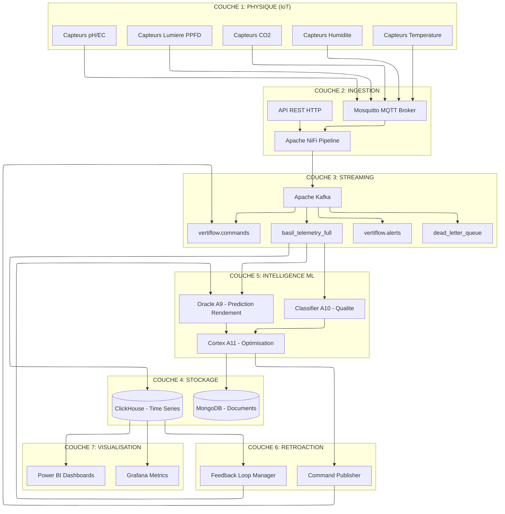

### 2.2 Golden Record - Schema 153 Colonnes

Toutes les donnees convergent vers une **table principale** dans ClickHouse: `basil_ultimate_realtime`

Cette table contient **153 colonnes** couvrant:
- Donnees environnementales (temperature, humidite, CO2, VPD)
- Donnees nutritives (pH, EC, concentrations NPK)
- Donnees lumineuses (PPFD, DLI, spectre)
- Donnees calculees (photosynthese, transpiration)
- Metadonnees (zone, rack, batch, timestamps)

---

## 3. Pipeline de Donnees NiFi

### 3.1 Architecture du Pipeline

Le pipeline NiFi est organise en **6 zones fonctionnelles** + une Dead Letter Queue:

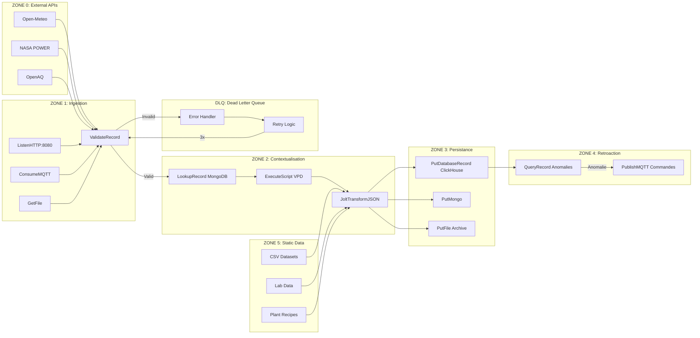

### 3.2 Protocole Vance (Gouvernance)

Chaque FlowFile traverse un processus de **validation zero-trust**:

1. **Validation Schema** - Conformite JSON Schema
2. **Validation Range** - Valeurs dans les bornes biologiques
3. **Enrichissement** - Ajout des metadonnees de gouvernance
4. **Estampillage** - Timestamp de traitement + checksum
5. **Routage** - Vers persistance ou DLQ

### 3.3 Scripts de Deploiement

| Script | Fonction |
|--------|----------|
| `deploy_pipeline_v2_full.py` | Deploiement complet (6 zones + DLQ) |
| `fix_invalid_processors.py` | Correction automatique des erreurs |
| `fix_queryrecord_vpd.py` | Correction des noms de colonnes SQL |
| `nifi_health_check.py` | Diagnostic de sante du pipeline |

---

## 4. Integration du Machine Learning

### 4.1 Les 11 Algorithmes Scientifiques

Le projet implemente **11 algorithmes** (A1-A11) repartis en 3 categories:

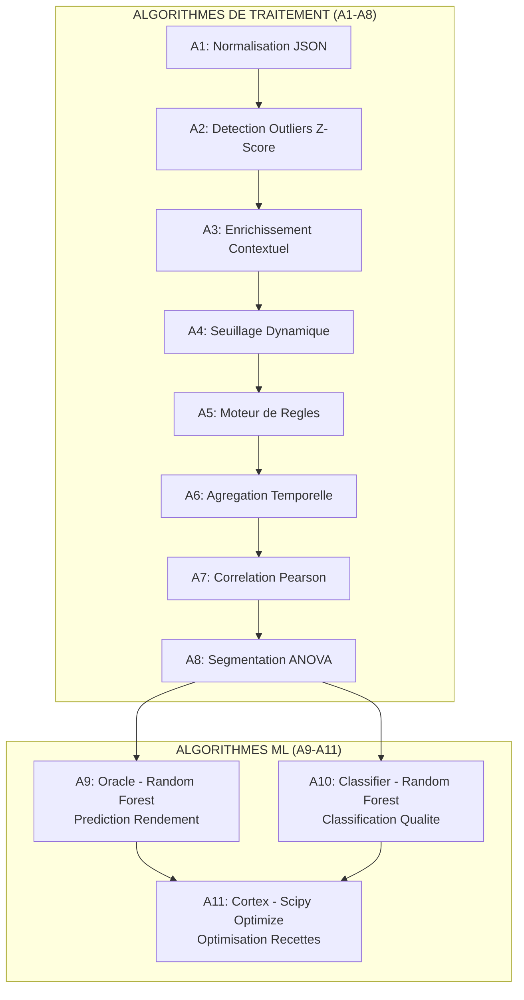

### 4.2 Oracle (A9) - Prediction de Rendement

**Fichier**: `cloud_citadel/nervous_system/oracle.py`

| Caracteristique | Valeur |
|-----------------|--------|
| **Algorithme** | Random Forest Regressor |
| **Librairie** | scikit-learn |
| **Features** | 5 dimensions (temp, PAR, humidite, CO2, stddev) |
| **Sortie** | Rendement predit (g/m²) + Score de confiance |
| **Frequence** | Toutes les 5 minutes par zone |

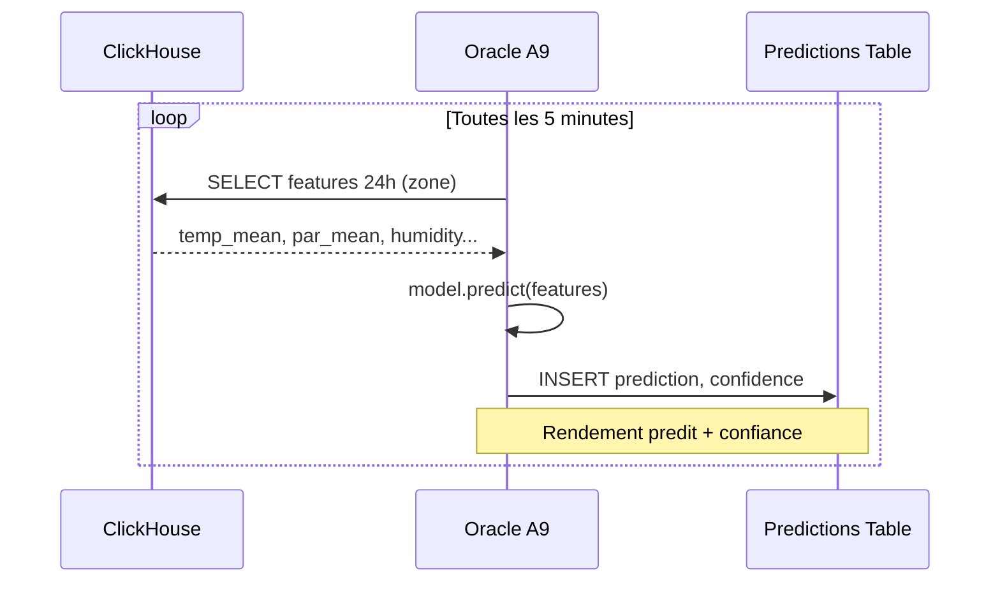

### 4.3 Classifier (A10) - Classification Qualite

**Fichier**: `cloud_citadel/nervous_system/classifier.py`

| Caracteristique | Valeur |
|-----------------|--------|
| **Algorithme** | Random Forest Classifier |
| **Classes** | PREMIUM, STANDARD, REJECT |
| **Source** | Topic Kafka `basil_telemetry_full` |
| **Sortie** | Topic Kafka `vertiflow.quality_predictions` |
| **Mode** | Streaming temps reel |

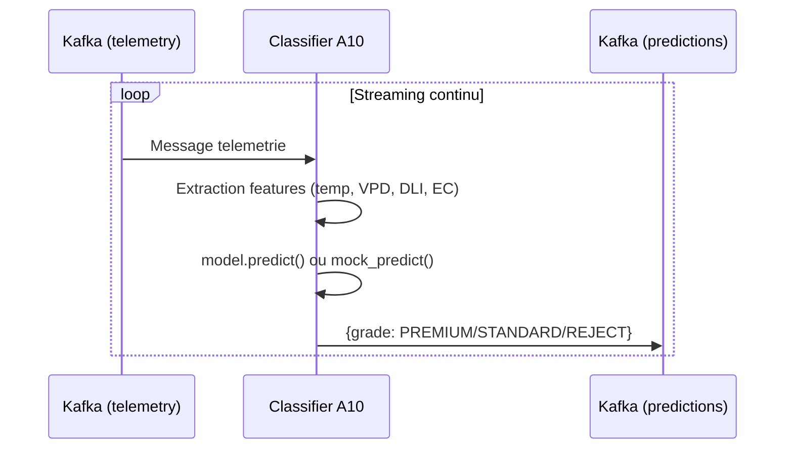

### 4.4 Cortex (A11) - Optimisation des Recettes

**Fichier**: `cloud_citadel/nervous_system/cortex.py`

| Caracteristique | Valeur |
|-----------------|--------|
| **Algorithme** | Minimisation L-BFGS-B (scipy.optimize) |
| **Objectif** | Maximiser (Yield × Quality - Cost) |
| **Variables** | Temperature, EC, DLI |
| **Contraintes** | Bornes biologiques |
| **Frequence** | Cycle 24h |

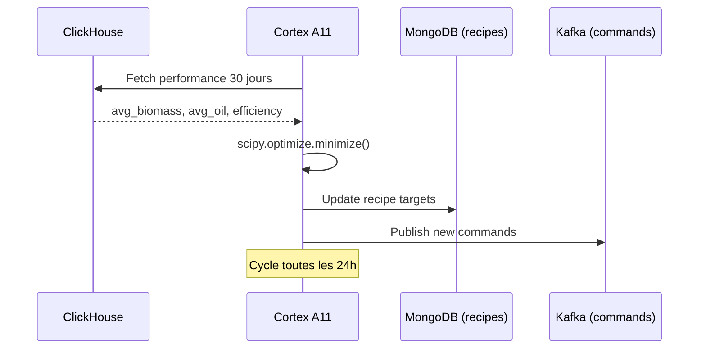

### 4.5 Feedback Loop - Apprentissage Continu

**Fichier**: `cloud_citadel/connectors/feedback_loop.py`

Le systeme apprend de ses erreurs via une boucle de retroaction:

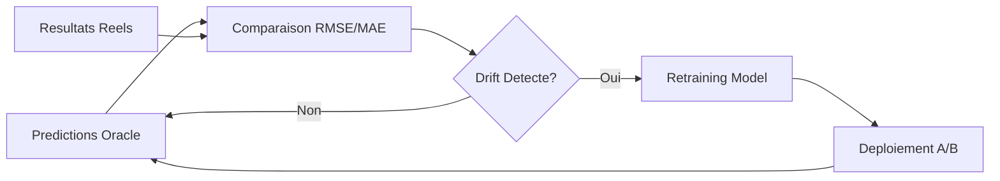

---

## 5. Stack Technologique

### 5.1 Vue d'Ensemble

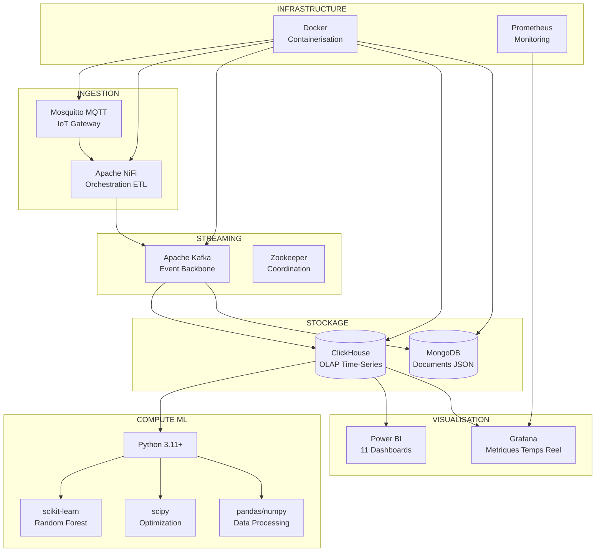

### 5.2 Configuration Centralisee

Toute la configuration est centralisee dans **`config/vertiflow_constants.py`**:

| Classe | Contenu |
|--------|---------|
| `KafkaTopics` | Noms des topics Kafka |
| `ClickHouseTables` | Tables et vues ClickHouse |
| `MongoDBCollections` | Collections MongoDB |
| `Infrastructure` | Hosts, ports, URIs |
| `Algorithms` | Identifiants A1-A11 |
| `FarmConfig` | Zones, racks, farm_id |

Cette approche garantit la **coherence** entre tous les modules du projet.

---

## 6. Diagrammes d'Orchestration

### 6.1 Flux de Donnees Complet

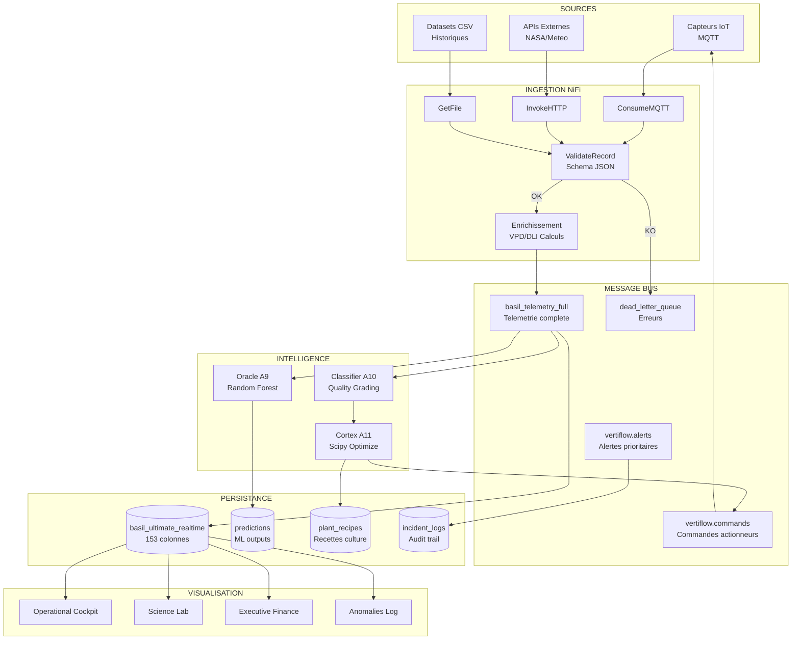

### 6.2 Cycle de Vie d'une Mesure

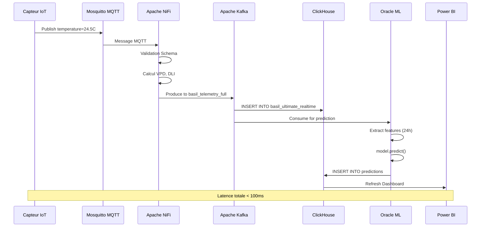

### 6.3 Architecture de Deploiement

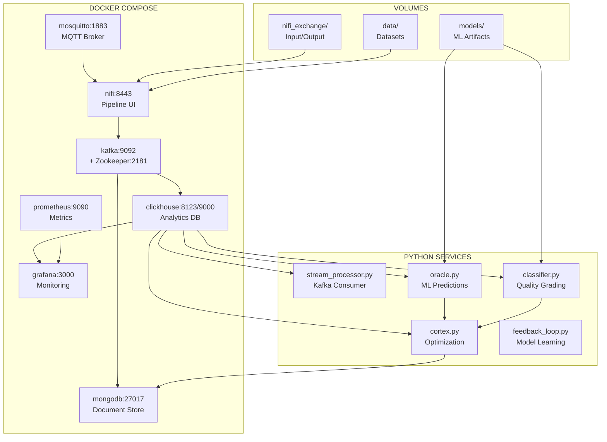

---

## 7. Etat Actuel et Prochaines Etapes

### 7.1 Travaux Realises

| Module | Statut | Description |
|--------|--------|-------------|
| **Infrastructure Docker** | Complet | Tous les services containerises |
| **Pipeline NiFi v2** | Complet | 6 zones + DLQ deployes |
| **Schema ClickHouse** | Complet | 153 colonnes + 11 vues Power BI |
| **Oracle A9** | Complet | Random Forest fonctionnel |
| **Classifier A10** | Complet | Classification qualite |
| **Cortex A11** | Complet | Optimisation scipy |
| **Configuration Centralisee** | Complet | vertiflow_constants.py |
| **Scripts NiFi** | Nettoyes | Suppression doublons, credentials centralises |

### 7.2 Nettoyage Effectue (Session Actuelle)

1. **Suppression dossier duplique** `vertiflow_ML/` (1.2 GB)
2. **Consolidation SQL** - Fusion des scripts predictions
3. **Centralisation NiFi** - Creation `nifi_config.py`
4. **Credentials securises** - Variables d'environnement
5. **Documentation** - README.md mis a jour

### 7.3 Prochaines Etapes Recommandees

| Priorite | Tache | Effort Estime |
|----------|-------|---------------|
| **P0** | Tests d'integration end-to-end | Court |
| **P1** | Entrainement modeles sur donnees reelles | Moyen |
| **P2** | Monitoring Prometheus complet | Moyen |
| **P3** | Documentation API (Swagger) | Court |
| **P4** | CI/CD Pipeline (GitHub Actions) | Moyen |

---

## Annexes

### A. Equipe Projet

| Membre | Role | Responsabilite |
|--------|------|----------------|
| @Mounir | Architecte & Scientifique | Architecture, ML, Bio-physique |
| @Imrane | DevOps & Infrastructure | Docker, NiFi, Deploiement |
| @Mouhammed | Data Engineer | ETL, ClickHouse, Kafka |
| @Asama | Biologiste | Validation scientifique |
| **@MrZakaria** | Encadrant | Architecture Data, Review |

### B. Repertoire du Code

```
test-projet-agri/
├── cloud_citadel/
│   ├── nervous_system/
│   │   ├── oracle.py          # A9 - Prediction rendement
│   │   ├── classifier.py      # A10 - Classification qualite
│   │   ├── cortex.py          # A11 - Optimisation recettes
│   │   └── simulator.py       # Calculs bio-physiques
│   └── connectors/
│       ├── stream_processor.py # Kafka → ClickHouse
│       └── feedback_loop.py    # Apprentissage continu
├── config/
│   └── vertiflow_constants.py  # SOURCE DE VERITE
├── infrastructure/
│   ├── docker-compose.yml
│   └── init_scripts/
├── scripts/
│   └── nifi_workflows/
│       ├── nifi_config.py      # Config centralisee
│       └── deploy/             # Scripts deploiement
└── docs/
    └── 01_ARCHITECTURE.md      # Documentation technique
```

### C. References

- Farquhar, G.D. et al. (1980) - Modele de photosynthese
- Murray, F.W. (1967) - Calcul pression de vapeur saturante
- Initiative JobInTech - YNOV Maroc Campus

---

**Document genere le**: Janvier 2026
**Version**: 1.0
**Statut**: Approuve pour revue par Mr. Zakaria
