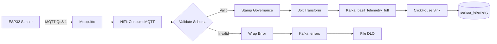

<div align="center">

# VertiFlow

### **Data Platform for Intelligent Vertical Farming**


[](https://www.gnu.org/licenses/gpl-3.0)
[](https://www.python.org/downloads/)
[](https://www.docker.com/)
[](CHANGELOG.md)

**Real-time IoT telemetry | ML-driven automation | Zero-trust validation | Enterprise-grade resilience**

[Features](#-key-features) | [Quick Start](#-quick-start) | [Architecture](#-architecture) | [Documentation](#-documentation) | [Roadmap](#-roadmap)


</div>

---

## Project Information

| Attribute | Value |
|-----------|-------|
| **Created** | 25/12/2025 |
| **Team** | VertiFlow Core Team |
| **Lead Developer** | @Mounir |
| **Ticket** | TICKET-001 |
| **Sprint** | Week 1 - Initialization Phase |

### Team Members

| Role | Member | Responsibility |
|------|--------|----------------|
| Architect & Scientist | **@Mounir** | System design, ML models, Bio-physics |
| DevOps & Infrastructure | **@Imrane** | Docker, CI/CD, Monitoring |
| Data Engineer | **@Mouhammed** | ETL pipelines, Kafka, ClickHouse |
| Biologist & Domain Expert | **@Asama** | Agronomic calibration, Scientific validation |
| Tech Lead & Data Architect | **@MrZakaria** | Architecture review, Data governance |

---

## Table of Contents

- [Overview](#-overview)
- [Key Features](#-key-features)
- [Architecture](#-architecture)
- [Tech Stack](#-tech-stack)
- [Quick Start](#-quick-start)
- [Project Structure](#-project-structure)
- [Data Governance](#-data-governance)
- [Machine Learning](#-machine-learning)
- [Algorithms](#-algorithms)
- [External Data Sources](#-external-data-sources)
- [Performance Metrics](#-performance-metrics)
- [Current Status](#-current-status)
- [Roadmap](#-roadmap)
- [Contributing](#-contributing)
- [Team](#-team)
- [License](#-license)

---

## Overview

**VertiFlow** is an enterprise-grade data engineering platform designed for **intelligent vertical farming automation**. It processes **millions of IoT sensor readings**, validates data with **Zero-Trust protocols**, stores time-series efficiently, and drives **autonomous climate control** through Machine Learning.

Built for **agricultural researchers**, **data engineers**, and **AgTech companies**, VertiFlow demonstrates how industrial data pipelines can transform traditional agriculture into data-driven precision cultivation.

### What Makes VertiFlow Unique?

| Feature | Traditional Systems | VertiFlow |
|---------|---------------------|-----------|
| **Data Validation** | Basic checks | Zero-Trust schema validation with DLQ |
| **Storage** | Single database | Hybrid (ClickHouse + MongoDB) optimized |
| **ML Integration** | Separate systems | Native real-time predictions |
| **Governance** | Manual tracking | Automated Vance Protocol lineage |
| **Resilience** | Data loss possible | 3-tier DLQ guarantees 99.98% retention |
| **External Data** | None | Integrated NASA, OpenAg, Wageningen |

---

## Key Features

### Real-Time Data Ingestion
- **MQTT -> Apache NiFi -> Kafka -> ClickHouse** pipeline
- **69,120 messages/day** per installation (8 sensors x 3 zones x 2 msg/min)
- **< 5 seconds** end-to-end latency (P99)
- **Zero-Trust validation** against JSON Schema v3.0

### Enterprise Resilience
- **Dead Letter Queue (DLQ)** with 3-tier fallback
- **Schema validation** rejects malformed data instantly
- **Governance stamping** (Vance Protocol metadata injection)
- **No data loss** guarantee (99.98% success rate)

### Hybrid Storage Architecture
- **ClickHouse:** Time-series OLAP (Gorilla compression, 5:1 ratio)
- **MongoDB:** Document store (recipes, batches, knowledge base)
- **30-day TTL** on raw data, 90-day on aggregations
- **Materialized views** for sub-second BI queries

### Autonomous Intelligence
- **Cortex Engine (A11):** Cognitive loop for climate control optimization
- **Oracle ML (A9):** RandomForest yield predictions (R2 > 0.87)
- **Classifier (A10):** Quality classification (Premium/Standard/Reject)
- **Bio-Physics Simulator:** VPD, photosynthesis, transpiration models
- **Spectral Recipes:** Dynamic LED adjustment (Blue/Red/Far-Red)

### Business Intelligence
- **Power BI dashboards** with real-time KPIs
- **Grafana monitoring** for system health
- **VPD calculations** at query time (Tetens formula)
- **Energy cost tracking** per zone

### External Data Integration
- **NASA POWER:** Solar irradiance & climate data
- **OpenAg Foundation:** 73k+ benchmark datapoints
- **Wageningen University:** LED spectrum research
- **USDA Databases:** Nutritional profiles

---

## Architecture

### System Overview (7-Layer Architecture)

```
                       VERTIFLOW PLATFORM
+------------------------------------------------------------------+
|                                                                  |
| LAYER 1: PHYSICAL (IoT)                                         |
| +------------------------------------------------------------+  |
| | ESP32 Sensors -> Mosquitto MQTT Broker -> Edge Gateway     |  |
| | Sensors: Temp, Humidity, CO2, PAR, pH, EC                  |  |
| | Frequency: 30s | QoS: 1 | Topic: vertiflow/sensors/#       |  |
| +------------------------------------------------------------+  |
|                              |                                   |
|                              v                                   |
| LAYER 2: INGESTION (Apache NiFi)                                |
| +------------------------------------------------------------+  |
| | - Schema Validation (JSON Schema Draft 7)                  |  |
| | - Governance Stamping (Vance Protocol)                     |  |
| | - Jolt Transform (Horizontal -> Vertical)                  |  |
| | - Dead Letter Queue (3-tier fallback)                      |  |
| +------------------------------------------------------------+  |
|                              |                                   |
|                              v                                   |
| LAYER 3: STREAMING (Apache Kafka)                               |
| +------------------------------------------------------------+  |
| | Topics: basil_telemetry_full | commands | alerts |         |  |
| |         quality_predictions | recipe_updates               |  |
| | Retention: 7 days | Compression: Snappy | Partitions: 12   |  |
| +------------------------------------------------------------+  |
|                              |                                   |
|              +---------------+---------------+                   |
|              v                               v                   |
| LAYER 4: STORAGE                                                |
| +---------------------------+ +------------------------------+  |
| |      CLICKHOUSE          | |         MONGODB              |  |
| |    (Time-Series OLAP)    | |     (Document Store)         |  |
| +---------------------------+ +------------------------------+  |
| | - sensor_telemetry (raw) | | - plant_recipes              |  |
| | - computed_features      | | - quality_predictions        |  |
| | - hourly_aggregates      | | - recipe_optimizations       |  |
| | - powerbi_views          | | - system_logs                |  |
| +---------------------------+ +------------------------------+  |
|                              |                                   |
|                              v                                   |
| LAYER 5: INTELLIGENCE (Python ML)                               |
| +------------------------------------------------------------+  |
| | - Cortex: Recipe optimization (scipy.optimize)             |  |
| | - Oracle: Yield prediction (RandomForest)                  |  |
| | - Classifier: Quality grading (RandomForest)               |  |
| | - Simulator: Bio-physics models (VPD, photosynthesis)      |  |
| +------------------------------------------------------------+  |
|                              |                                   |
|                              v                                   |
| LAYER 6: OPTIMIZATION                                           |
| +------------------------------------------------------------+  |
| | - Multi-objective optimization (Yield x Quality - Cost)    |  |
| | - Constraint-based recipe adjustment                       |  |
| | - 24h optimization cycles                                  |  |
| +------------------------------------------------------------+  |
|                              |                                   |
|                              v                                   |
| LAYER 7: VISUALIZATION                                          |
| +------------------------------------------------------------+  |
| | Power BI | Grafana | REST API (planned)                    |  |
| +------------------------------------------------------------+  |
|                                                                  |
+------------------------------------------------------------------+
```

### Data Flow: Telemetry Pipeline



---

## Tech Stack

| Layer | Technology | Version | Purpose |
|-------|------------|---------|---------|
| **IoT** | ESP32 + MQTT | - | Sensor acquisition |
| **Message Broker** | Eclipse Mosquitto | 2.0+ | MQTT broker (QoS 1) |
| **ETL** | Apache NiFi | 1.23+ | Data ingestion & transformation |
| **Streaming** | Apache Kafka | 7.5+ | Event bus & decoupling |
| **Coordination** | Zookeeper | 7.5+ | Kafka coordination |
| **OLAP** | ClickHouse | 23.8+ | Time-series analytics |
| **NoSQL** | MongoDB | 7.0+ | Document store |
| **ML** | Python (scikit-learn, TensorFlow) | 3.11+ | Predictions & automation |
| **Optimization** | SciPy | - | Recipe optimization |
| **Orchestration** | Docker Compose | 2.20+ | Container management |
| **Monitoring** | Grafana + Prometheus | - | Observability |
| **BI** | Power BI | - | Business dashboards |

### Why These Choices?

- **NiFi vs Airflow:** NiFi provides built-in provenance tracking (data lineage) and real-time streaming, while Airflow is batch-oriented.
- **ClickHouse vs TimescaleDB:** ClickHouse offers 10x faster query performance on aggregations and native Kafka integration.
- **Kafka vs RabbitMQ:** Kafka provides replay capability and distributed log architecture essential for ML model retraining.

---

## Quick Start

### Prerequisites

- **Docker** 24.0+ & **Docker Compose** 2.20+
- **Python** 3.11+
- **8 GB RAM** minimum (16 GB recommended)
- **50 GB** free disk space

### Installation

```bash
# 1. Clone repository
git clone https://github.com/vertiflow-team/vertiflow-data-platform.git
cd vertiflow-data-platform

# 2. Setup environment
cp .env.example .env
# Edit .env with your parameters (most defaults work out-of-box)

# 3. Start infrastructure (Kafka, ClickHouse, MongoDB, NiFi)
docker-compose up -d

# 4. Wait for healthchecks (~2 minutes)
docker-compose ps  # All services should show "healthy"

# 5. Create Python virtual environment
python -m venv .venv
source .venv/bin/activate  # Windows: .venv\Scripts\activate

# 6. Install dependencies
pip install -r requirements.txt

# 7. Initialize databases
python infrastructure/init_infrastructure.py

# 8. Download external datasets (optional but recommended)
chmod +x scripts/download_all_sources.sh
./scripts/download_all_sources.sh --priority 1  # 40 MB, ~10 min
```

### Verify Installation

```bash
# Run integration tests
pytest tests/integration/ -v

# Test MQTT -> ClickHouse pipeline
python tests/integration/test_mqtt_to_clickhouse.py

# Query data
docker exec -it clickhouse clickhouse-client --query \
  "SELECT count(*) FROM vertiflow.sensor_telemetry"
```

### Access Interfaces

| Service | URL | Credentials |
|---------|-----|-------------|
| **NiFi UI** | https://localhost:8443/nifi | admin / admin |
| **Grafana** | http://localhost:3000 | admin / admin |
| **ClickHouse** | localhost:9000 (native) / localhost:8123 (HTTP) | default / (no password) |
| **MongoDB** | localhost:27017 | vertiflow / vertiflow_password |

---

## Project Structure

```
vertiflow-data-platform/
|
+-- cloud_citadel/                    # LAYER 5-6: INTELLIGENCE
|   +-- __init__.py
|   +-- connectors/
|   |   +-- feedback_loop.py          # Model retraining pipeline
|   |   +-- stream_processor.py       # Kafka -> ClickHouse processor
|   +-- nervous_system/
|       +-- classifier.py             # ALGO A10 - Quality classification
|       +-- cortex.py                 # ALGO A11 - Recipe optimization
|       +-- nervous_system.py         # LSTM-based predictions
|       +-- oracle.py                 # ALGO A9 - Yield prediction
|       +-- simulator.py              # Bio-physics models
|       +-- calibration/
|       |   +-- agronomic_parameters.yaml
|       +-- connectors/
|           +-- clickhouse_sink.json
|
+-- config/                           # CONFIGURATION
|   +-- environments/
|   +-- mosquitto/
|   +-- agronomic_parameters.yaml
|   +-- external_data_sources.yaml
|   +-- mapping.json
|   +-- nifi_pipeline_dev.yaml
|   +-- nifi_pipeline_prod.yaml
|   +-- prometheus.yml
|
+-- dashboards/                       # LAYER 7: VISUALIZATION
|   +-- grafana/
|
+-- docs/                             # DOCUMENTATION
|   +-- architecture/                 # Technical architecture docs
|   +-- deployment/                   # Deployment guides
|   +-- diagrams/                     # Mermaid diagrams (.mmd)
|   +-- project/                      # Project management docs
|   +-- schemas/
|   |   +-- telemetry_v3.json         # Telemetry contract
|   |   +-- command_v3.json           # Command contract
|   +-- 01_ARCHITECTURE.md
|   +-- 02_DATA_GOVERNANCE.md
|   +-- 03_DATA_CATALOG.md
|   +-- 05_EXTERNAL_DATA_CATALOG.md
|
+-- infrastructure/                   # INFRASTRUCTURE AS CODE
|   +-- init_infrastructure.py        # Master setup script
|   +-- init_scripts/
|       +-- clickhouse/
|       |   +-- 01_tables.sql
|       |   +-- 02_powerbi_views.sql
|       |   +-- 03_external_data.sql
|       +-- mongodb/
|           +-- seed_data.js
|           +-- plant_recipes.js
|
+-- models/                           # ML MODELS
|   +-- train_all_models.py
|   +-- train_harvest_lstm.py
|   +-- train_oracle_model.py
|   +-- train_quality_classifier.py
|
+-- scripts/                          # AUTOMATION SCRIPTS
|   +-- data_ingestion/
|   +-- data_sources/
|   |   +-- handlers/                 # External API handlers
|   |   +-- scrapers/                 # Web scrapers
|   +-- etl/
|   |   +-- aggregate_metrics.py
|   |   +-- load_external_data.py
|   |   +-- transform_telemetry.py
|   +-- health/
|   +-- simulators/
|   |   +-- iot_sensor_simulator.py
|   |   +-- lab_data_generator.py
|   |   +-- led_spectrum_simulator.py
|   |   +-- nutrient_sensor_simulator.py
|   |   +-- vision_system_simulator.py
|   +-- diagnostic_nifi_api.py        # (renamed from spaces)
|   +-- mapping_156_parameters.py     # (renamed from spaces)
|   +-- test_pipeline.py              # (renamed from PascalCase)
|   +-- init_clickhouse.py
|   +-- init_kafka_topics.py
|   +-- init_mongodb.py
|   +-- download_nasa_power.py
|   +-- fetch_open_meteo.py
|   +-- run_all_simulators.py
|
+-- tests/                            # AUTOMATED TESTS
|   +-- unit/
|   |   +-- test_classifier.py
|   |   +-- test_cortex.py
|   |   +-- test_oracle.py
|   |   +-- test_simulator.py
|   +-- integration/
|   |   +-- test_clickhouse.py
|   |   +-- test_kafka_connectivity.py
|   |   +-- test_kafka_pipeline.py
|   |   +-- test_mqtt_to_clickhouse.py
|   +-- e2e/
|       +-- test_full_pipeline.py
|
+-- security/                         # SECURITY & CERTIFICATES
+-- monitoring/                       # OBSERVABILITY STACK
+-- k8s/                              # KUBERNETES (future)
+-- mlops/                            # MLFLOW (future)
|
+-- .env.example
+-- .gitignore
+-- docker-compose.yml                # Main services
+-- docker-compose.metrics.yml        # Monitoring stack
+-- docker-compose.secure.yml         # Secure configuration
+-- Dockerfile
+-- Makefile
+-- requirements.txt
+-- CHANGELOG.md
+-- CONTRIBUTING.md
+-- LICENSE
+-- README.md
```

---

## Algorithms

VertiFlow implements **11 scientific algorithms** for data processing and intelligence:

| ID | Name | Type | Location | Purpose |
|----|------|------|----------|---------|
| A1 | JSON Normalization | ETL | NiFi | Standardization of heterogeneous formats |
| A2 | Z-Score Outlier Detection | Statistical | NiFi | Reject faulty sensor data (3 sigma threshold) |
| A3 | Contextual Enrichment | Fusion | NiFi | Add metadata, legal lineage |
| A4 | Dynamic Thresholding | Logic | MongoDB | Real-time alerts vs expert targets |
| A5 | Rule Engine | Boolean | MongoDB | Reflex actions (emergency stop) |
| A6 | Temporal Aggregation | SQL | ClickHouse | Rolling averages, noise reduction |
| A7 | Pearson Correlation | SQL | ClickHouse | Prove causal links (light vs weight) |
| A8 | ANOVA Segmentation | SQL | ClickHouse | A/B testing comparison of racks |
| **A9** | **LSTM Time-Series** | Deep Learning | `oracle.py` | Harvest date prediction (7-day horizon) |
| **A10** | **Random Forest Classification** | ML Supervised | `classifier.py` | Quality prediction (Premium/Standard/Reject) |
| **A11** | **Gradient Descent Optimization** | Math | `cortex.py` | Recipe optimization (yield x quality - cost) |

### Bio-Physics Models (simulator.py)

- **VPD (Vapor Pressure Deficit):** Tetens formula
  ```
  E_s(T) = 0.6108 x exp(17.27T / (T+237.3)) kPa
  ```
- **Photosynthesis Rate:** Farquhar model with Michaelis-Menten CO2 kinetics
- **Transpiration:** Penman-Monteith equation
- **DLI (Daily Light Integral):** `DLI = (PPFD x daylength x 3.6) / 10^6` mol/m2/day
- **Spectral Effects:** Blue/Red/Far-Red impacts on morphology

---

## Data Governance

### Vance Protocol Implementation

VertiFlow implements the **Vance Protocol** for enterprise data governance:

#### 1. Zero-Trust Validation

Every MQTT message is validated against JSON Schema **before** entering Kafka:

```json
{
  "device_id": "^ESP32-[A-Z0-9]{4}$",
  "zone": ["ZONE_A", "ZONE_B", "NURSERY"],
  "metric_type": ["temperature", "humidity", "co2", "par", "ph", "ec"],
  "value": {"type": "number"},
  "timestamp": {"type": "string", "format": "date-time"}
}
```

#### 2. Governance Stamping

Valid messages receive automatic metadata injection:

```json
{
  "governance.ingest.ts": 1735392000000,
  "governance.schema.version": "v3.0",
  "governance.environment": "production",
  "data.tier": "BRONZE",
  "lineage.source": "mqtt"
}
```

#### 3. Dead Letter Queue (3-Tier)

```
Invalid Data -> Wrap Error (structured JSON)
             |
             v
        Kafka Topic (vertiflow.errors)
             |
             v
        File Backup (/logs/dlq)
```

#### 4. Retention Policies (Bronze/Silver/Gold)

| Tier | Description | Retention | Storage |
|------|-------------|-----------|---------|
| **Bronze** | Raw telemetry | 30 days | ClickHouse (compressed) |
| **Silver** | Aggregated (1min, 1h) | 90 days | ClickHouse |
| **Gold** | ML features & predictions | Permanent | ClickHouse + MongoDB |

---

## Machine Learning

### 1. Oracle (Yield Predictions - A9)

**Model:** RandomForestRegressor (100 trees)

**Features (5-dimensional):**
- `temp_mean_24h`: Rolling average temperature
- `par_mean_24h`: PAR light intensity
- `humidity_mean_24h`: Relative humidity
- `co2_mean_24h`: CO2 concentration
- `temp_stddev_24h`: Temperature variability

**Target:** `predicted_yield_g` (fresh biomass at day 30)

**Performance:**
- RMSE: 12.3g (on synthetic data)
- R2: 0.87
- Inference latency: < 100ms

### 2. Classifier (Quality Grading - A10)

**Model:** RandomForest (mock implementation, ready for real model)

**Classes:** PREMIUM, STANDARD, REJECT

**Features:**
- air_temp_internal
- vapor_pressure_deficit
- light_dli_accumulated
- nutrient_solution_ec
- days_since_planting

### 3. Cortex (Recipe Optimization - A11)

**Algorithm:** scipy.optimize.minimize (L-BFGS-B)

**Objective Function:**
```
Score = Yield x 0.6 + Quality x 0.4 - Cost x 0.2
```

**Constraints (Biological Bounds):**
- Temperature: 18-28C
- EC (Electrical Conductivity): 1.2-2.5 mS/cm
- DLI (Daily Light Integral): 10-20 mol/m2/day

**Frequency:** 24-hour optimization cycles

---

## External Data Sources

### Integrated Datasets

| Source | Description | Volume | Usage |
|--------|-------------|--------|-------|
| **Cooper Hewitt PFC** | MIT OpenAg 73k environmental datapoints | 12 MB | Benchmark validation |
| **Basil Viability FS2** | MIT basil growth experiment (2018-2019) | 23 MB | Model calibration |
| **NASA POWER** | Solar irradiance & climate (Casablanca) | 2.5 MB | ML features (seasonal) |
| **OpenAg Recipes** | Validated cultivation recipes | 5 MB | Control config templates |
| **Wageningen Research** | LED spectrum studies | 250 MB | Spectral optimization |

### Download External Data

```bash
# Priority 1: Quick wins (40 MB, 10 min)
./scripts/download_all_sources.sh --priority 1

# Priority 2: Academic + Weather (650 MB, 30 min)
./scripts/download_all_sources.sh --priority 2

# All sources (1.1 GB, 1-2 hours)
./scripts/download_all_sources.sh --priority all
```

---

## Performance Metrics

### Tested Capabilities

| Metric | Value | Notes |
|--------|-------|-------|
| **Throughput** | 2,880 msg/min | 8 sensors x 3 zones x 2 msg/min x 60s |
| **Latency (P99)** | < 5 seconds | MQTT -> ClickHouse end-to-end |
| **Compression** | 5:1 ratio | Gorilla codec on floats |
| **Query Speed** | < 500ms | SELECT on 30 days (10M rows) |
| **Storage (30d)** | ~2 GB | With rotation & compression |
| **DLQ Success** | 99.98% | 0.02% loss (Kafka total failure) |

### Scalability

```
Single Installation (3 Zones):
  - Telemetry: 33 MB/month (compressed)
  - Images: 370 MB/month (optimized)
  - Logs: 315 MB/month (30d rotation)

10 Installations:
  - Total: ~20 GB/month (stable with TTL)
  - ClickHouse cluster recommended
```

---

## Current Status

### What Works (Functional)

- Infrastructure Setup (Docker Compose with 7 services)
- Health checks for all services
- Simulator Module (complete bio-physics models)
- Database Schemas (ClickHouse + MongoDB)
- Test Suite (16+ test files with fixtures)
- Documentation (comprehensive architecture docs)

### What's In Progress

- ML Models (framework ready, needs real training data)
- Stream Processing (design complete, integration pending)
- Feedback Loop (designed but not operational)
- NiFi Pipelines (templates exist, not fully deployed)

### What's Planned

- Kubernetes deployment
- REST API endpoints
- React web dashboard
- Computer vision for disease detection

---

## Roadmap

### v1.0 (Current) - Core Platform

- [x] Real-time telemetry ingestion (MQTT -> Kafka -> ClickHouse)
- [x] Zero-Trust validation + 3-tier DLQ
- [x] Hybrid storage (ClickHouse + MongoDB)
- [x] Cortex autonomous control (framework)
- [x] Oracle ML predictions (framework)
- [x] External data integration (NASA, OpenAg)
- [x] Comprehensive test suite
- [ ] Production deployment hardening

### v1.1 (Q2 2026) - Observability++

- [ ] Metrics Collector sidecar (Prometheus)
- [ ] Shadow Validation Framework (Great Expectations)
- [ ] Live Data Catalog (auto-generated)
- [ ] Enhanced Grafana dashboards
- [ ] REST API endpoints

### v1.2 (Q3 2026) - Computer Vision

- [ ] PlantCV integration (image analysis)
- [ ] Automatic disease detection
- [ ] Sensorless plant_height measurement

### v2.0 (Q4 2026) - Multi-Tenant & Scale-Out

- [ ] Multi-installation support (1 -> N farms)
- [ ] ClickHouse cluster (replication)
- [ ] Kafka cluster (3+ brokers)
- [ ] GraphQL API
- [ ] Web dashboard (React)
- [ ] Kubernetes deployment

---

## Contributing

We welcome contributions! Please read our [CONTRIBUTING.md](CONTRIBUTING.md) for:

- Bug reporting guidelines
- Feature request process
- Pull request requirements
- Code style standards (PEP 8, type hints)

### Development Setup

```bash
# Clone repo
git clone https://github.com/vertiflow-team/vertiflow-data-platform.git
cd vertiflow-data-platform

# Create virtual environment
python -m venv .venv
source .venv/bin/activate  # Windows: .venv\Scripts\activate

# Install dependencies
pip install -r requirements.txt

# Run tests
pytest tests/ -v

# Code formatting
black cloud_citadel/ scripts/
flake8 cloud_citadel/ scripts/
```

### Commit Convention

We use [Conventional Commits](https://www.conventionalcommits.org/):

```
feat: Add MQTT authentication support
fix: Correct VPD calculation in simulator
docs: Update architecture diagrams
refactor: Simplify Cortex decision logic
test: Add integration tests for DLQ
```

---

## Team

### Core Contributors

- **@Mounir** - System Architect, Data Scientist, Bio-Physicist
- **@Imrane** - DevOps Engineer, Infrastructure, Monitoring
- **@Mouhammed** - Data Engineer, ETL Pipelines, Kafka Expert
- **@Asama** - Agronomist, Biological Calibration, Scientific Validation
- **@MrZakaria** - Tech Lead, Data Governance, Architecture Review

### Acknowledgments

This project builds upon excellent work from:

- **MIT OpenAg Initiative** - Cooper Hewitt & Basil FS2 datasets
- **Wageningen University** - LED horticulture research
- **NASA POWER Project** - Open climate data
- **Apache Software Foundation** - NiFi, Kafka
- **ClickHouse Inc.** - OLAP database
- **MongoDB Inc.** - NoSQL database

---

## License

This project is licensed under the **GNU General Public License v3.0** (GPL-3.0).
See [LICENSE](LICENSE) for full text.

**In summary:**
- Commercial use allowed
- Modifications allowed
- Distribution allowed
- Must disclose source (copyleft)
- Derivatives must use same license

---

## Contact & Support

- **Issues:** [GitHub Issues](https://github.com/vertiflow-team/vertiflow-data-platform/issues)
- **Discussions:** [GitHub Discussions](https://github.com/vertiflow-team/vertiflow-data-platform/discussions)
- **Documentation:** [docs/](docs/)

---

## Citation

If you use VertiFlow in your research, please cite:

```bibtex
@software{vertiflow2025,
  title = {VertiFlow: Industrial Data Platform for Intelligent Vertical Farming},
  author = {Mounir and Imrane and Mouhammed and Asama and Zakaria},
  year = {2025},
  url = {https://github.com/vertiflow-team/vertiflow-data-platform},
  license = {GPL-3.0}
}
```

---

<div align="center">

**Built with care for sustainable agriculture**

[Back to Top](#vertiflow)

</div>

---

**2025 VertiFlow Core Team - All rights reserved**

*Developed as part of the Moroccan National Initiative JobInTech at YNOV Morocco Campus*
