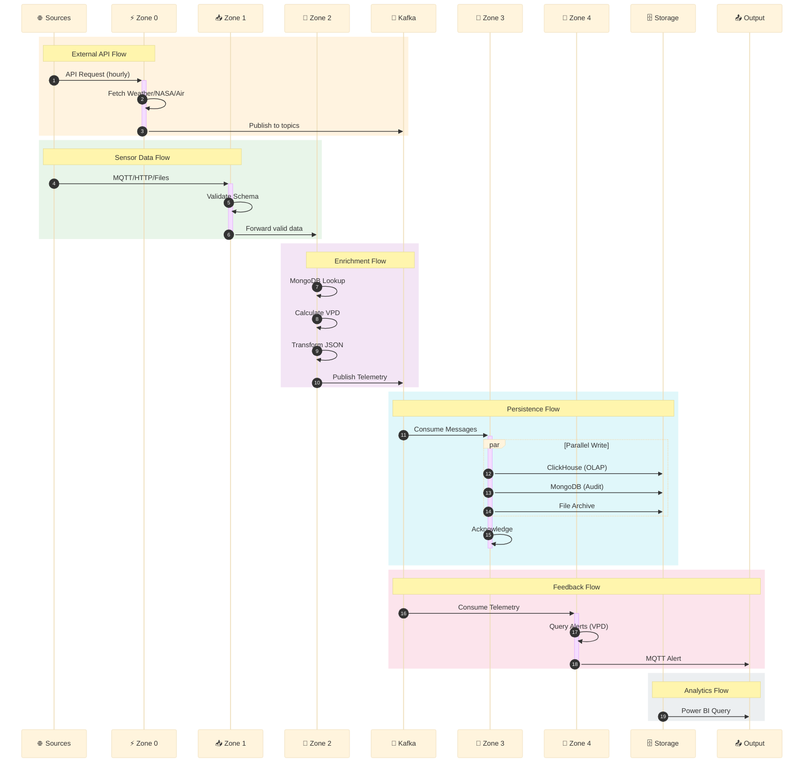
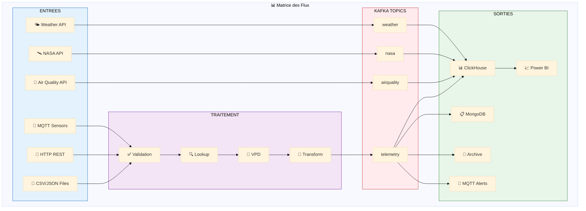

# VertiFlow - Data Flow Animation

## Flux de Donnees Anime

```mermaid
%%{init: {'theme': 'base', 'themeVariables': { 'primaryColor': '#4CAF50', 'primaryTextColor': '#fff', 'primaryBorderColor': '#2E7D32', 'lineColor': '#FF5722', 'secondaryColor': '#2196F3', 'tertiaryColor': '#FFC107'}}}%%
flowchart LR
    %% ========================================
    %% SOURCES DE DONNEES (Gauche)
    %% ========================================
    subgraph SOURCES["🌐 SOURCES"]
        direction TB
        API_EXT["☁️ APIs Externes<br/>Weather, NASA, Air"]
        MQTT_SRC["📡 Capteurs IoT<br/>MQTT Sensors"]
        HTTP_SRC["🔗 REST API<br/>HTTP Endpoints"]
        FILE_SRC["📁 Fichiers<br/>CSV, JSON"]
    end

    %% ========================================
    %% ZONE 0 - EXTERNAL APIs
    %% ========================================
    subgraph Z0["⚡ ZONE 0"]
        direction TB
        Z0_TRIGGER["⏰ Triggers"]
        Z0_API["🌍 API Calls"]
        Z0_PUB["📤 Publish"]
        Z0_TRIGGER --> Z0_API --> Z0_PUB
    end

    %% ========================================
    %% ZONE 1 - INGESTION
    %% ========================================
    subgraph Z1["📥 ZONE 1"]
        direction TB
        Z1_INGEST["📨 Ingestion"]
        Z1_VALID["✅ Validation"]
        Z1_MONITOR["👁️ Monitor"]
        Z1_INGEST --> Z1_VALID --> Z1_MONITOR
    end

    %% ========================================
    %% ZONE 2 - ENRICHISSEMENT
    %% ========================================
    subgraph Z2["🔧 ZONE 2"]
        direction TB
        Z2_LOOKUP["🔍 Lookup"]
        Z2_VPD["🧮 VPD Calc"]
        Z2_TRANSFORM["🔄 Transform"]
        Z2_PUB["📤 Publish"]
        Z2_LOOKUP --> Z2_VPD --> Z2_TRANSFORM --> Z2_PUB
    end

    %% ========================================
    %% KAFKA HUB CENTRAL
    %% ========================================
    subgraph KAFKA_HUB["🔴 KAFKA"]
        direction TB
        K_WEATHER["weather"]
        K_NASA["nasa"]
        K_AIR["airquality"]
        K_TELEMETRY["telemetry"]
    end

    %% ========================================
    %% ZONE 3 - PERSISTANCE
    %% ========================================
    subgraph Z3["💾 ZONE 3"]
        direction TB
        Z3_CONSUME["📥 Consume"]
        Z3_CLICK["🗄️ ClickHouse"]
        Z3_MONGO["🍃 MongoDB"]
        Z3_FILE["📁 Archive"]
        Z3_CONSUME --> Z3_CLICK
        Z3_CONSUME --> Z3_MONGO
        Z3_CONSUME --> Z3_FILE
    end

    %% ========================================
    %% ZONE 4 - RETROACTION
    %% ========================================
    subgraph Z4["🔔 ZONE 4"]
        direction TB
        Z4_CONSUME["📥 Consume"]
        Z4_QUERY["🔎 Query"]
        Z4_ALERT["⚠️ Alerts"]
        Z4_MQTT["📡 MQTT Out"]
        Z4_CONSUME --> Z4_QUERY --> Z4_ALERT --> Z4_MQTT
    end

    %% ========================================
    %% ZONE 5 - STATIC DATA
    %% ========================================
    subgraph Z5["📚 ZONE 5"]
        direction TB
        Z5_FILES["📄 Files"]
        Z5_RECIPES["🌱 Recipes"]
        Z5_MARKET["💰 Market"]
    end

    %% ========================================
    %% STOCKAGE FINAL
    %% ========================================
    subgraph STORAGE["🗃️ STOCKAGE"]
        direction TB
        DB_CLICK[("📊 ClickHouse<br/>Time-Series")]
        DB_MONGO[("📋 MongoDB<br/>Documents")]
        DB_FILES[("📁 Files<br/>Archive")]
    end

    %% ========================================
    %% SORTIE
    %% ========================================
    subgraph OUTPUT["📤 SORTIES"]
        direction TB
        OUT_DASH["📈 Dashboard<br/>Power BI"]
        OUT_MQTT["📡 MQTT<br/>Alertes"]
        OUT_API["🔗 API<br/>External"]
    end

    %% ========================================
    %% DLQ
    %% ========================================
    subgraph DLQ["❌ DLQ"]
        DLQ_LOG["📝 Error Log"]
    end

    %% ========================================
    %% FLUX PRINCIPAUX (Animations)
    %% ========================================

    %% Sources vers Zones d'ingestion
    API_EXT ==>|"☁️ data"| Z0
    MQTT_SRC ==>|"📡 sensors"| Z1
    HTTP_SRC ==>|"🔗 api"| Z1
    FILE_SRC ==>|"📁 files"| Z1
    FILE_SRC ==>|"📁 static"| Z5

    %% Zone 0 vers Kafka
    Z0_PUB ==>|"🌤️"| K_WEATHER
    Z0_PUB ==>|"🛰️"| K_NASA
    Z0_PUB ==>|"💨"| K_AIR

    %% Zone 1 vers Zone 2
    Z1_MONITOR ==>|"✅ valid"| Z2

    %% Zone 2 vers Kafka
    Z2_PUB ==>|"📊"| K_TELEMETRY

    %% Kafka vers Zone 3 & 4
    K_TELEMETRY ==>|"📊 data"| Z3_CONSUME
    K_TELEMETRY ==>|"📊 data"| Z4_CONSUME

    %% Zone 3 vers Stockage
    Z3_CLICK ==>|"⚡ insert"| DB_CLICK
    Z3_MONGO ==>|"📝 insert"| DB_MONGO
    Z3_FILE ==>|"💾 save"| DB_FILES

    %% Zone 4 vers Output
    Z4_MQTT ==>|"🔔 alert"| OUT_MQTT

    %% Zone 5 vers MongoDB
    Z5_RECIPES ==>|"🌱"| DB_MONGO
    Z5_MARKET ==>|"💰"| DB_MONGO

    %% Stockage vers Dashboard
    DB_CLICK ==>|"📈 query"| OUT_DASH

    %% Erreurs vers DLQ
    Z1_VALID -.->|"❌"| DLQ_LOG
    Z2_LOOKUP -.->|"❌"| DLQ_LOG
    Z2_VPD -.->|"❌"| DLQ_LOG

    %% ========================================
    %% STYLES ET COULEURS
    %% ========================================

    %% Couleurs des zones
    style SOURCES fill:#E3F2FD,stroke:#1565C0,stroke-width:3px
    style Z0 fill:#FFF3E0,stroke:#E65100,stroke-width:3px
    style Z1 fill:#E8F5E9,stroke:#2E7D32,stroke-width:3px
    style Z2 fill:#F3E5F5,stroke:#7B1FA2,stroke-width:3px
    style Z3 fill:#E0F7FA,stroke:#00838F,stroke-width:3px
    style Z4 fill:#FCE4EC,stroke:#C2185B,stroke-width:3px
    style Z5 fill:#FFF8E1,stroke:#FF8F00,stroke-width:3px
    style KAFKA_HUB fill:#FFEBEE,stroke:#C62828,stroke-width:4px
    style STORAGE fill:#ECEFF1,stroke:#37474F,stroke-width:3px
    style OUTPUT fill:#E8EAF6,stroke:#283593,stroke-width:3px
    style DLQ fill:#FFCDD2,stroke:#B71C1C,stroke-width:2px

    %% Couleurs des topics Kafka
    style K_WEATHER fill:#BBDEFB,stroke:#1976D2
    style K_NASA fill:#C8E6C9,stroke:#388E3C
    style K_AIR fill:#FFECB3,stroke:#FFA000
    style K_TELEMETRY fill:#F8BBD9,stroke:#C2185B

    %% Couleurs des bases de donnees
    style DB_CLICK fill:#B2EBF2,stroke:#00838F,stroke-width:2px
    style DB_MONGO fill:#C8E6C9,stroke:#2E7D32,stroke-width:2px
    style DB_FILES fill:#CFD8DC,stroke:#455A64,stroke-width:2px
```

## Legende des Flux

| Couleur | Signification |
|---------|---------------|
| 🔵 Bleu | Sources externes (APIs, HTTP) |
| 🟠 Orange | Zone 0 - APIs Externes |
| 🟢 Vert | Zone 1 - Ingestion & Validation |
| 🟣 Violet | Zone 2 - Contextualisation |
| 🔵 Cyan | Zone 3 - Persistance |
| 🔴 Rose | Zone 4 - Retroaction |
| 🟡 Jaune | Zone 5 - Static Data |
| ⬛ Gris | Stockage Final |
| 🔴 Rouge | Kafka Hub & DLQ |

## Flux Detaille avec Timing

## Matrice des Flux de Donnees

## Vue Temporelle du Pipeline

```mermaid
%%{init: {'theme': 'base'}}%%
gantt
    title Pipeline VertiFlow - Flux Temporel
    dateFormat X
    axisFormat %s

    section Zone 0
    Trigger Weather    :z0a, 0, 1
    API Call Weather   :z0b, after z0a, 2
    Publish Weather    :z0c, after z0b, 1

    section Zone 1
    Receive Data       :z1a, 0, 1
    Validate Schema    :z1b, after z1a, 1
    Monitor Health     :z1c, after z1b, 1

    section Zone 2
    Lookup Context     :z2a, after z1c, 1
    Calculate VPD      :z2b, after z2a, 1
    Transform JSON     :z2c, after z2b, 1
    Publish Kafka      :z2d, after z2c, 1

    section Zone 3
    Consume Kafka      :z3a, after z2d, 1
    Write ClickHouse   :z3b, after z3a, 2
    Write MongoDB      :z3c, after z3a, 1
    Write Archive      :z3d, after z3a, 1

    section Zone 4
    Consume Feedback   :z4a, after z2d, 1
    Query Alerts       :z4b, after z4a, 1
    Publish MQTT       :z4c, after z4b, 1
```

## Code Couleur des Donnees

| Type de Donnee | Couleur | Source | Destination |
|----------------|---------|--------|-------------|
| 🌤️ Weather | `#BBDEFB` | Open-Meteo API | ClickHouse |
| 🛰️ NASA | `#C8E6C9` | NASA POWER API | ClickHouse |
| 💨 Air Quality | `#FFECB3` | OpenAQ API | ClickHouse |
| 📊 Telemetry | `#F8BBD9` | Capteurs IoT | ClickHouse + MongoDB |
| 🌱 Recipes | `#DCEDC8` | JSON Files | MongoDB |
| 💰 Market | `#FFE0B2` | Scraped Data | MongoDB |
| ⚠️ Alerts | `#FFCDD2` | Zone 4 | MQTT |

---
**VertiFlow Data Pipeline - Animation Diagram**
**Generated: 2026-01-14**
