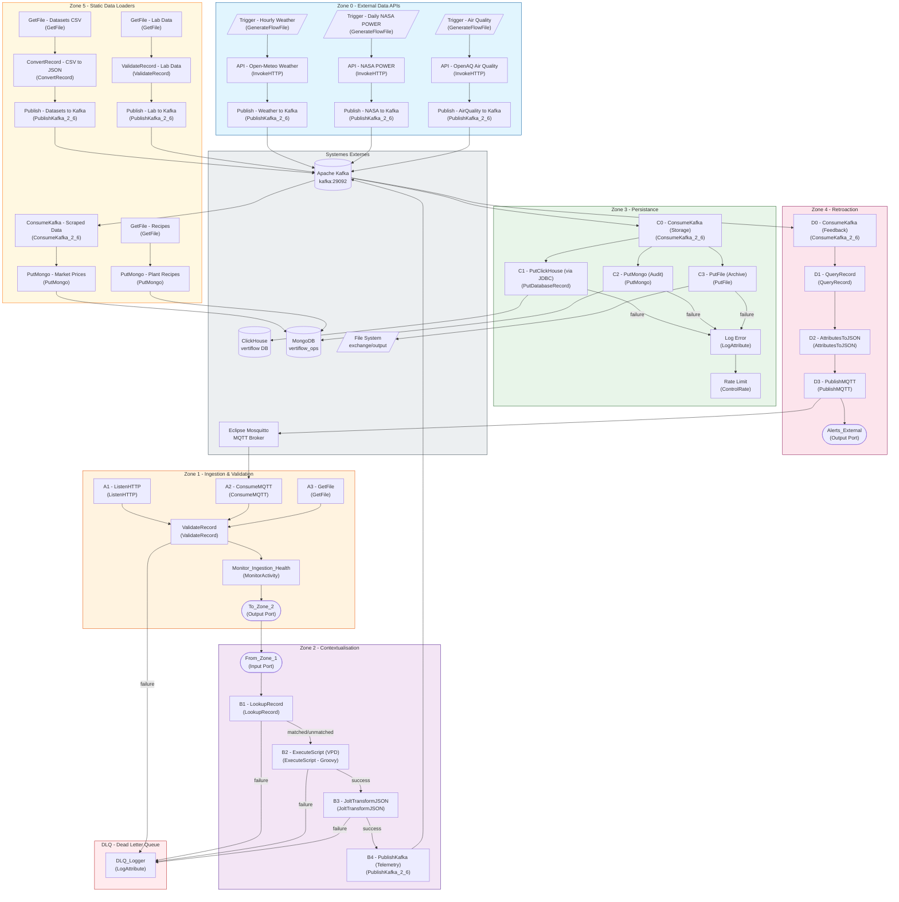
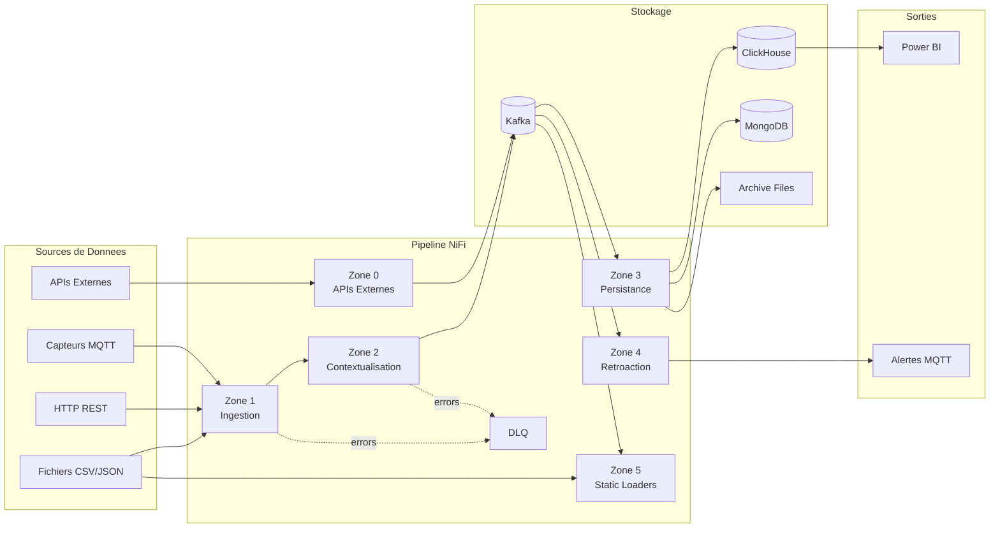
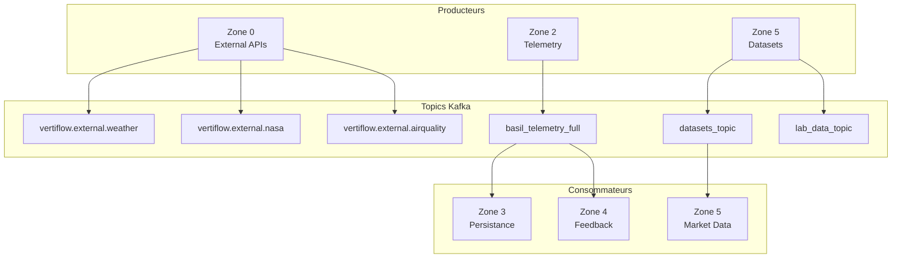
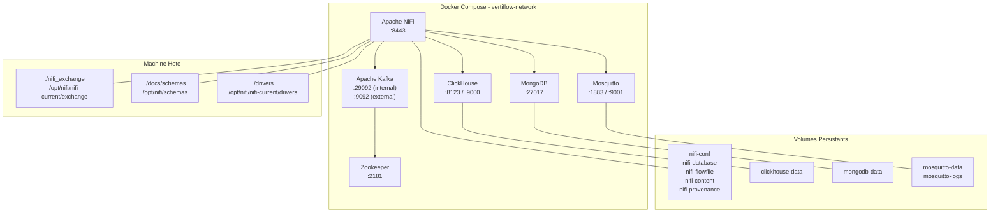

# VertiFlow NiFi Pipeline - Architecture Diagram

## Vue d'Ensemble Complète

## Flux de Donnees Simplifie

## Architecture des Topics Kafka

## Details par Zone

### Zone 0 - External Data APIs
| Processeur | Type | Description |
|-----------|------|-------------|
| Trigger - Hourly Weather | GenerateFlowFile | Declencheur horaire pour meteo |
| Trigger - Daily NASA POWER | GenerateFlowFile | Declencheur quotidien NASA |
| Trigger - Air Quality | GenerateFlowFile | Declencheur qualite de l'air |
| API - Open-Meteo Weather | InvokeHTTP | Appel API meteo Open-Meteo |
| API - NASA POWER | InvokeHTTP | Appel API NASA POWER |
| API - OpenAQ Air Quality | InvokeHTTP | Appel API qualite air |
| Publish - Weather to Kafka | PublishKafka_2_6 | Publication vers Kafka |
| Publish - NASA to Kafka | PublishKafka_2_6 | Publication vers Kafka |
| Publish - AirQuality to Kafka | PublishKafka_2_6 | Publication vers Kafka |

### Zone 1 - Ingestion & Validation
| Processeur | Type | Description |
|-----------|------|-------------|
| A1 - ListenHTTP | ListenHTTP | Reception donnees HTTP REST |
| A2 - ConsumeMQTT | ConsumeMQTT | Reception capteurs MQTT |
| A3 - GetFile | GetFile | Lecture fichiers locaux |
| ValidateRecord | ValidateRecord | Validation schema JSON |
| Monitor_Ingestion_Health | MonitorActivity | Surveillance ingestion |

### Zone 2 - Contextualisation
| Processeur | Type | Description |
|-----------|------|-------------|
| B1 - LookupRecord | LookupRecord | Enrichissement via MongoDB lookup |
| B2 - ExecuteScript (VPD) | ExecuteScript | Calcul VPD (Vapor Pressure Deficit) |
| B3 - JoltTransformJSON | JoltTransformJSON | Transformation structure JSON |
| B4 - PublishKafka (Telemetry) | PublishKafka_2_6 | Publication telemetrie vers Kafka |

### Zone 3 - Persistance
| Processeur | Type | Description |
|-----------|------|-------------|
| C0 - ConsumeKafka (Storage) | ConsumeKafka_2_6 | Consommation depuis Kafka |
| C1 - PutClickHouse (via JDBC) | PutDatabaseRecord | Insertion ClickHouse (OLAP) |
| C2 - PutMongo (Audit) | PutMongo | Insertion MongoDB (audit) |
| C3 - PutFile (Archive) | PutFile | Archivage fichiers |

### Zone 4 - Retroaction
| Processeur | Type | Description |
|-----------|------|-------------|
| D0 - ConsumeKafka (Feedback) | ConsumeKafka_2_6 | Consommation feedback |
| D1 - QueryRecord | QueryRecord | Filtrage alertes SQL |
| D2 - AttributesToJSON | AttributesToJSON | Conversion attributs en JSON |
| D3 - PublishMQTT | PublishMQTT | Publication alertes MQTT |

### Zone 5 - Static Data Loaders
| Processeur | Type | Description |
|-----------|------|-------------|
| GetFile - Recipes | GetFile | Chargement recettes agronomiques |
| GetFile - Lab Data | GetFile | Chargement donnees laboratoire |
| GetFile - Datasets CSV | GetFile | Chargement datasets CSV |
| ValidateRecord - Lab Data | ValidateRecord | Validation donnees labo |
| ConvertRecord - CSV to JSON | ConvertRecord | Conversion CSV vers JSON |
| PutMongo - Plant Recipes | PutMongo | Stockage recettes |
| PutMongo - Market Prices | PutMongo | Stockage prix marche |

### DLQ - Dead Letter Queue
| Processeur | Type | Description |
|-----------|------|-------------|
| DLQ_Logger | LogAttribute | Journalisation des erreurs |

## Infrastructure Docker

---
**Genere automatiquement pour le projet VertiFlow**
**Date: 2026-01-14**
