# Architecture Complète VertiFlow - Diagramme Mermaid

## Note: Le Golden Record contient **157 colonnes** (pas 153)

## 1. Vue d'Ensemble du Système

```mermaid
flowchart TB
    subgraph STAGE0["🏗️ STAGE 0 - INFRASTRUCTURE"]
        DC[docker-compose.yml]
        ENV[.env]
        CONFIG[config/]
    end

    subgraph STAGE1["🔧 STAGE 1 - INITIALISATION"]
        INIT[init_infrastructure.py]
        INITCH[init_clickhouse.py]
        INITMG[init_mongodb.py]
        INITKF[init_kafka_topics.py]
        SQL1[table_1.sql]
        SQL2[table_2.sql]
        SQL3[tables_v2_full.sql]
    end

    subgraph STAGE2["🔄 STAGE 2 - NIFI DEPLOYMENT"]
        DEPLOY[deploy_pipeline_v2_full.py]
        FIX1[fix_invalid_processors.py]
        FIX2[fix_complete_flow.py]
        FIX3[fix_queryrecord_vpd.py]
        HEALTH[nifi_health_check.py]
        ACTIVATE[activate_pipeline.py]
    end

    subgraph STAGE3["📡 STAGE 3 - SIMULATEURS"]
        IOTSIM[iot_sensor_simulator.py]
        LEDSIM[led_spectrum_simulator.py]
        NUTSIM[nutrient_sensor_simulator.py]
        KAFKAPROD[kafka_telemetry_producer.py]
        RUNALL[run_all_simulators.py]
    end

    subgraph STAGE4["⚙️ STAGE 4 - ETL"]
        TRANSFORM[transform_telemetry.py]
        K2CH[kafka_to_clickhouse.py]
        MAPPING[mapping_156_parameters.py]
        BLOCKCHAIN[blockchain_hash_processor.py]
    end

    subgraph STAGE5["🌐 STAGE 5 - EXTERNAL DATA"]
        OPENMETEO[openmeteo_handler.py]
        NASA[nasa_power_handler.py]
        OPENAQ[openaq_handler.py]
        FETCH[fetch_all_external_data.py]
    end

    subgraph STAGE6["🧠 STAGE 6 - ML/AI"]
        ORACLE[oracle.py]
        CORTEX[cortex.py]
        CLASSIFIER[quality_classifier.py]
        LSTM[lstm_predictor.py]
        OPTIMIZER[recipe_optimizer.py]
    end

    subgraph STAGE7["📊 STAGE 7 - MONITORING"]
        GRAFANA[dashboards/]
        PROMETHEUS[prometheus_alerts.yml]
        POWERBI[dashboards_powerbi.pbix]
    end

    subgraph STAGE8["🧪 STAGE 8 - TESTS"]
        UNIT[tests/unit/]
        INTEG[tests/integration/]
        E2E[tests/e2e/]
    end

    subgraph STAGE9["🎯 STAGE 9 - ORCHESTRATOR"]
        START[start_vertiflow.py]
    end

    %% Connexions principales
    STAGE0 --> STAGE1
    STAGE1 --> STAGE2
    STAGE2 --> STAGE3
    STAGE3 --> STAGE4
    STAGE4 --> STAGE5
    STAGE5 --> STAGE6
    STAGE6 --> STAGE7
    STAGE7 --> STAGE8
    STAGE9 -.->|orchestre| STAGE1
    STAGE9 -.->|orchestre| STAGE2
    STAGE9 -.->|orchestre| STAGE3
    STAGE9 -.->|orchestre| STAGE4
```

## 2. Flux de Données Complet

```mermaid
flowchart LR
    subgraph PHYSICAL["🌱 COUCHE PHYSIQUE"]
        SENSORS[Capteurs IoT<br/>Temp/Hum/CO2/pH/EC]
        LED[Panneaux LED<br/>Spectrum PPFD]
        PUMPS[Pompes<br/>Nutriments]
    end

    subgraph INGESTION["📥 INGESTION"]
        MQTT[MQTT Broker<br/>Mosquitto:1883]
        HTTP[HTTP Listener<br/>NiFi:8080]
        FILES[GetFile<br/>/nifi_exchange/input]
    end

    subgraph NIFI["🔄 APACHE NIFI"]
        direction TB
        Z1[Zone 1<br/>Validation]
        Z2[Zone 2<br/>Contextualisation]
        Z25[Zone 2.5<br/>Blockchain Hash]
        Z3[Zone 3<br/>Persistance]
        Z4[Zone 4<br/>Rétroaction]
        Z5[Zone 5<br/>Static Loaders]
        DLQ[Dead Letter Queue]

        Z1 --> Z2 --> Z25 --> Z3
        Z3 --> Z4
        Z1 -.->|erreur| DLQ
        Z2 -.->|erreur| DLQ
    end

    subgraph STREAMING["📨 KAFKA"]
        KT1[basil_telemetry_full<br/>6 partitions]
        KT2[vertiflow.commands]
        KT3[vertiflow.alerts]
        KT4[dead_letter_queue]
        KT5[quality_predictions]
        KT6[recipe_updates]
    end

    subgraph STORAGE["💾 STOCKAGE"]
        CH[(ClickHouse<br/>OLAP Time-Series<br/>vertiflow.golden_record)]
        MG[(MongoDB<br/>Documents<br/>plant_recipes<br/>quality_predictions<br/>recipe_optimizations)]
        ARCHIVE[Archive Files<br/>/nifi_exchange/output]
    end

    subgraph INTELLIGENCE["🧠 INTELLIGENCE"]
        A1[A1: Normalisation]
        A2[A2: Aberration]
        A3[A3: Enrichissement]
        A4[A4: Seuillage]
        A5[A5: Règles]
        A6[A6: Agrégation]
        A7[A7: Corrélation]
        A8[A8: Segmentation]
        A9[A9: LSTM Prédiction]
        A10[A10: Classification]
        A11[A11: Optimisation]
    end

    subgraph FEEDBACK["🔁 RÉTROACTION"]
        CMDS[Commandes<br/>Actuateurs]
        ALERTS[Alertes<br/>Opérateurs]
    end

    %% Flux principal
    SENSORS -->|MQTT| MQTT
    LED -->|MQTT| MQTT
    PUMPS -->|HTTP| HTTP

    MQTT --> Z1
    HTTP --> Z1
    FILES --> Z1

    Z3 -->|PutDatabaseRecord| CH
    Z3 -->|PutMongo| MG
    Z3 -->|PutFile| ARCHIVE
    Z3 -->|PublishKafka| KT1

    KT1 --> A1
    A1 --> A2 --> A3 --> A4
    A4 --> A5 --> A6 --> A7
    A7 --> A8 --> A9 --> A10 --> A11

    A10 -->|prédictions| MG
    A11 -->|optimisations| MG
    A11 -->|recettes| KT6

    A4 -->|alertes| KT3
    KT3 --> ALERTS

    KT2 --> CMDS
    CMDS --> PUMPS
    CMDS --> LED
```

## 3. Architecture MongoDB

```mermaid
flowchart TB
    subgraph MONGODB["🍃 MongoDB - vertiflow_ops"]
        subgraph COLLECTIONS["Collections"]
            PR[(plant_recipes<br/>Recettes de culture)]
            QP[(quality_predictions<br/>Prédictions A10)]
            RO[(recipe_optimizations<br/>Historique A11)]
        end

        subgraph INDEXES["Index"]
            I1[recipe_id + version]
            I2[batch_id + prediction_date]
            I3[recipe_id + optimization_date]
        end
    end

    subgraph WRITERS["📝 Écrivains"]
        INIT[init_mongodb.py<br/>Seed initial]
        NIFI_PUT[NiFi PutMongo<br/>Données temps-réel]
        CORTEX[cortex.py<br/>Prédictions ML]
        OPTIM[recipe_optimizer.py<br/>Optimisations]
    end

    subgraph READERS["📖 Lecteurs"]
        LOOKUP[NiFi LookupRecord<br/>Enrichissement recettes]
        ORACLE[oracle.py<br/>Règles métier]
        DASHBOARD[Grafana/PowerBI<br/>Visualisation]
    end

    INIT -->|upsert| PR
    NIFI_PUT -->|insert| PR
    CORTEX -->|insert| QP
    OPTIM -->|insert| RO

    PR -->|lookup| LOOKUP
    PR -->|query| ORACLE
    QP -->|aggregate| DASHBOARD
    RO -->|aggregate| DASHBOARD

    I1 -.-> PR
    I2 -.-> QP
    I3 -.-> RO
```

## 4. Architecture ClickHouse

## 5. Pipeline NiFi Détaillé

```mermaid
flowchart TB
    subgraph Z0["Zone 0 - External APIs"]
        METEO[InvokeHTTP<br/>Open-Meteo]
        NASA[InvokeHTTP<br/>NASA POWER]
        AQ[InvokeHTTP<br/>OpenAQ]
    end

    subgraph Z1["Zone 1 - Ingestion"]
        HTTP[ListenHTTP<br/>:8080]
        MQTT[ConsumeMQTT<br/>vertiflow/telemetry/#]
        FILE[GetFile<br/>/input/*.json]
        VALID[ValidateRecord<br/>JSON Schema]
    end

    subgraph Z2["Zone 2 - Contextualisation"]
        LOOKUP[LookupRecord<br/>MongoDB Recipes]
        VPD[ExecuteScript<br/>Calcul VPD]
        JOLT[JoltTransformJSON<br/>Normalisation]
    end

    subgraph Z25["Zone 2.5 - Blockchain"]
        HASH[ExecuteScript<br/>blockchain_hash_processor.py]
    end

    subgraph Z3["Zone 3 - Persistance"]
        PUTCH[PutDatabaseRecord<br/>ClickHouse]
        PUTMG[PutMongo<br/>MongoDB]
        PUTFILE[PutFile<br/>/output/]
        PUBKF[PublishKafka<br/>basil_telemetry_full]
    end

    subgraph Z4["Zone 4 - Rétroaction"]
        QREC[QueryRecord<br/>Détection anomalies]
        PUBMQTT[PublishMQTT<br/>Commandes]
        PUBALERT[PublishKafka<br/>vertiflow.alerts]
    end

    subgraph Z5["Zone 5 - Static Data"]
        CSV[GetFile<br/>datasets/*.csv]
        LAB[GetFile<br/>lab_data/]
        RECIPES[GetFile<br/>plant_recipes/]
    end

    subgraph DLQ["Dead Letter Queue"]
        DLQFILE[PutFile<br/>/dlq/]
        DLQKF[PublishKafka<br/>dead_letter_queue]
    end

    %% Flux Zone 0
    METEO --> Z1
    NASA --> Z1
    AQ --> Z1

    %% Flux Zone 1
    HTTP --> VALID
    MQTT --> VALID
    FILE --> VALID
    VALID -->|success| Z2
    VALID -->|failure| DLQ

    %% Flux Zone 2
    LOOKUP --> VPD --> JOLT --> Z25

    %% Flux Zone 2.5
    HASH --> Z3

    %% Flux Zone 3
    PUTCH
    PUTMG
    PUTFILE
    PUBKF

    %% Flux Zone 4
    PUBKF --> QREC
    QREC -->|anomaly| PUBALERT
    QREC -->|command| PUBMQTT

    %% Flux Zone 5
    CSV --> VALID
    LAB --> VALID
    RECIPES --> PUTMG
```

## 6. Algorithmes ML (A1-A11)

```mermaid
flowchart LR
    subgraph INPUT["📥 Entrée"]
        RAW[Données Brutes<br/>157 colonnes]
    end

    subgraph PREPROCESSING["🔧 Prétraitement"]
        A1[A1: Normalisation<br/>MinMax/Standard]
        A2[A2: Aberration<br/>IQR/Z-Score]
        A3[A3: Enrichissement<br/>Recettes MongoDB]
    end

    subgraph RULES["📏 Règles"]
        A4[A4: Seuillage<br/>Limites Biologiques]
        A5[A5: Règles Métier<br/>Conditions Culture]
    end

    subgraph ANALYTICS["📊 Analytics"]
        A6[A6: Agrégation<br/>Moyennes/Tendances]
        A7[A7: Corrélation<br/>Inter-variables]
        A8[A8: Segmentation<br/>Clustering K-Means]
    end

    subgraph PREDICTION["🔮 Prédiction"]
        A9[A9: LSTM<br/>Séries Temporelles]
        A10[A10: Classification<br/>Qualité Récolte]
    end

    subgraph OPTIMIZATION["⚡ Optimisation"]
        A11[A11: Recettes<br/>Genetic Algorithm]
    end

    subgraph OUTPUT["📤 Sortie"]
        PRED[Prédictions<br/>quality_predictions]
        OPT[Optimisations<br/>recipe_optimizations]
        ALERT[Alertes<br/>vertiflow.alerts]
        CMD[Commandes<br/>vertiflow.commands]
    end

    RAW --> A1 --> A2 --> A3
    A3 --> A4 --> A5
    A5 --> A6 --> A7 --> A8
    A8 --> A9 --> A10
    A10 --> A11

    A4 -->|threshold breach| ALERT
    A10 -->|prediction| PRED
    A11 -->|recipe| OPT
    A11 -->|command| CMD
```

## 7. Orchestration start_vertiflow.py

## 8. Dépendances entre Scripts

## 9. Résumé Visuel

```mermaid
graph TB
    subgraph LEGEND["📋 Légende"]
        L1[🌱 Physique]
        L2[📥 Ingestion]
        L3[🔄 Traitement]
        L4[💾 Stockage]
        L5[🧠 Intelligence]
        L6[📊 Visualisation]
        L7[🔁 Rétroaction]
    end

    subgraph SYSTEM["🏭 VERTIFLOW - Système Complet"]
        PHYS[🌱 Capteurs IoT<br/>LED / Pompes]

        ING[📥 MQTT + HTTP<br/>+ Files]

        NIFI[🔄 Apache NiFi<br/>6 Zones + DLQ]

        KAFKA[📨 Apache Kafka<br/>6 Topics]

        STORE[💾 ClickHouse + MongoDB<br/>157 cols + 3 collections]

        ML[🧠 11 Algorithmes<br/>A1-A11]

        VIZ[📊 Grafana + PowerBI<br/>Dashboards]

        FEED[🔁 Commandes<br/>+ Alertes]
    end

    PHYS -->|telemetry| ING
    ING -->|validate| NIFI
    NIFI -->|publish| KAFKA
    KAFKA -->|consume| STORE
    STORE -->|query| ML
    ML -->|predict| VIZ
    ML -->|command| FEED
    FEED -->|actuate| PHYS

    style PHYS fill:#90EE90
    style ING fill:#87CEEB
    style NIFI fill:#FFB6C1
    style KAFKA fill:#DDA0DD
    style STORE fill:#F0E68C
    style ML fill:#FFA07A
    style VIZ fill:#98FB98
    style FEED fill:#ADD8E6
```

---

## Fichiers Clés par Composant

| Composant | Fichiers Principaux |
|-----------|---------------------|
| **Orchestrateur** | `start_vertiflow.py`, `run_all_simulators.py` |
| **Infrastructure** | `docker-compose.yml`, `init_infrastructure.py` |
| **NiFi** | `deploy_pipeline_v2_full.py`, `fix_*.py` |
| **Simulateurs** | `iot_sensor_simulator.py`, `kafka_telemetry_producer.py` |
| **ETL** | `transform_telemetry.py`, `kafka_to_clickhouse.py` |
| **ML/AI** | `oracle.py`, `cortex.py`, `quality_classifier.py` |
| **Stockage** | `table_1.sql`, `tables_v2_full.sql` |
| **Monitoring** | `prometheus_alerts.yml`, `dashboards_powerbi.pbix` |
