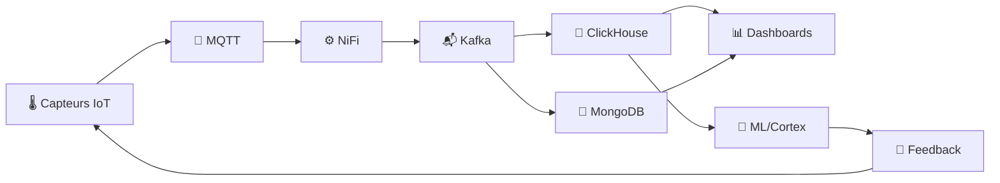

# 📊 Diagrammes VertiFlow

Cette section contient tous les diagrammes Mermaid de l'architecture VertiFlow.

## 📁 Index des Diagrammes

| Fichier | Description | Niveau |
|---------|-------------|--------|
| [architecture_globale.mmd](architecture_globale.mmd) | Vue d'ensemble des flux de données | 🟢 Simple |
| [architecture_globale_v2.mmd](architecture_globale_v2.mmd) | Architecture globale v2 avec animations | 🟡 Intermédiaire |
| [architecture_7_couches.mmd](architecture_7_couches.mmd) | Détail des 7 couches de l'architecture | 🟡 Intermédiaire |
| [data_pipeline_v5.mmd](data_pipeline_v5.mmd) | Pipeline NiFi complet (50 processeurs) | 🔴 Avancé |
| [algorithmes.mmd](algorithmes.mmd) | Chaîne des 11 algorithmes scientifiques | 🟢 Simple |
| [kafka.mmd](kafka.mmd) | Architecture de streaming Kafka | 🟡 Intermédiaire |
| [nifi.mmd](nifi.mmd) | Processeurs NiFi détaillés | 🟡 Intermédiaire |
| [master_v2.mmd](master_v2.mmd) | Vue intégrée v2 | 🟡 Intermédiaire |
| [master_v3.mmd](master_v3.mmd) | Vue intégrée v3 | 🔴 Avancé |
| [master_v4.mmd](master_v4.mmd) | Vue intégrée v4 (complète) | 🔴 Avancé |
| [pipeline_summary.mmd](pipeline_summary.mmd) | Résumé du pipeline | 🟢 Simple |
| [processors_detail.mmd](processors_detail.mmd) | Détail des processeurs | 🟡 Intermédiaire |

## 🔧 Comment Visualiser

### Option 1 : VS Code Extension
Installer l'extension **Markdown Preview Mermaid Support** dans VS Code.

### Option 2 : Mermaid Live Editor
Copier le contenu du fichier `.mmd` dans [Mermaid Live Editor](https://mermaid.live/).

### Option 3 : GitHub
GitHub rend automatiquement les diagrammes Mermaid dans les fichiers `.md`.

## 🎨 Légende des Couleurs

| Couleur | Signification |
|---------|---------------|
| 🔵 Bleu | Ingestion / Sources |
| 🟢 Vert | Traitement / Enrichissement |
| 🟠 Orange | Stockage / Persistance |
| 🟣 Violet | Intelligence / ML |
| 🔴 Rouge | Alertes / DLQ |
| 🟡 Jaune | Visualisation |

## 📐 Architecture en 7 Couches

```
┌─────────────────────────────────────────┐
│ COUCHE 7: Visualisation                 │ → Grafana, Power BI, Agri-Copilot
├─────────────────────────────────────────┤
│ COUCHE 6: Optimisation                  │ → Optimisation multi-objectifs
├─────────────────────────────────────────┤
│ COUCHE 5: Intelligence                  │ → ML (Oracle, Classifier, Cortex)
├─────────────────────────────────────────┤
│ COUCHE 4: Stockage                      │ → ClickHouse + MongoDB
├─────────────────────────────────────────┤
│ COUCHE 3: Streaming                     │ → Apache Kafka
├─────────────────────────────────────────┤
│ COUCHE 2: Ingestion                     │ → Apache NiFi
├─────────────────────────────────────────┤
│ COUCHE 1: Physique                      │ → ESP32, MQTT, Capteurs IoT
└─────────────────────────────────────────┘
```

## 🔄 Flux Principal



---

**Documentation complète :** [Retour au README principal](../../README.md)
